# Yi CreativeStudio - Create Page User Flow

## Overview
This document maps the complete user journey for creating brand creatives in Yi CreativeStudio.

---

## User Flow Diagram

```mermaid
flowchart TD
    %% Styling
    classDef startEnd fill:#005B96,color:#fff,stroke:#003d66
    classDef process fill:#E8F4FD,stroke:#005B96,color:#1a1a1a
    classDef decision fill:#FFF3E0,stroke:#FF6B35,color:#1a1a1a
    classDef action fill:#E8F5E9,stroke:#4CAF50,color:#1a1a1a

    %% Flow Start
    START([User Opens App]):::startEnd

    %% Step 1: Authentication
    START --> AUTH{Logged In?}:::decision
    AUTH -->|No| LOGIN[Login / Sign Up]:::process
    LOGIN --> DASH[Dashboard]:::process
    AUTH -->|Yes| DASH

    %% Step 2: Navigate to Create
    DASH --> CREATE[Click 'Create' or 'AI Create']:::action

    %% Step 3: Creative Type Selection
    CREATE --> FORMAT[Select Creative Format]:::process
    FORMAT --> FORMAT_OPTIONS{Choose Format}:::decision
    FORMAT_OPTIONS --> EP[Event Poster]:::process
    FORMAT_OPTIONS --> CERT[Certificate]:::process
    FORMAT_OPTIONS --> SOCIAL[Social Media Post]:::process
    FORMAT_OPTIONS --> OTHER[Other Formats...]:::process

    EP --> METHOD
    CERT --> METHOD
    SOCIAL --> METHOD
    OTHER --> METHOD

    %% Step 4: Creation Method
    METHOD{Creation Method}:::decision
    METHOD -->|Template| TEMPLATE[Browse Templates]:::process
    METHOD -->|AI Create| VERTICAL[Select Vertical]:::process

    TEMPLATE --> TEMPLATE_SELECT[Select & Customize Template]:::action
    TEMPLATE_SELECT --> DETAILS

    %% Step 5: Vertical Selection (AI Create path)
    VERTICAL --> VERTICAL_OPTIONS{Choose Vertical}:::decision
    VERTICAL_OPTIONS --> YI_MAIN[Yi Main]:::process
    VERTICAL_OPTIONS --> YUVA[Yuva]:::process
    VERTICAL_OPTIONS --> MASOOM[Masoom]:::process
    VERTICAL_OPTIONS --> ARTH[Arth]:::process
    VERTICAL_OPTIONS --> OTHER_V[Other Verticals...]:::process

    YI_MAIN --> DETAILS
    YUVA --> DETAILS
    MASOOM --> DETAILS
    ARTH --> DETAILS
    OTHER_V --> DETAILS

    %% Step 6: Event Details
    DETAILS[Enter Event Details]:::process
    DETAILS --> PASTE{Paste Option?}:::decision
    PASTE -->|Yes| PASTE_TEXT[Paste Event Text]:::action
    PASTE -->|No| MANUAL[Fill Form Manually]:::action
    PASTE_TEXT --> AI_EXTRACT[AI Extracts Fields]:::process
    AI_EXTRACT --> FORM_REVIEW
    MANUAL --> FORM_REVIEW

    FORM_REVIEW[Review Form Fields]:::process
    FORM_REVIEW --> REQUIRED{Required Fields Complete?}:::decision
    REQUIRED -->|No| DETAILS
    REQUIRED -->|Yes| LOGO_STYLE

    %% Step 7: Logo & Styling
    LOGO_STYLE[Configure Logo Strip & Styling]:::process
    LOGO_STYLE --> HEADER[Header Strip Setup]:::action
    HEADER --> FOOTER[Footer Bar Setup]:::action
    FOOTER --> THEME[Select Theme & Colors]:::action
    THEME --> TYPOGRAPHY[Typography Settings]:::action

    %% Step 8: Resolution
    TYPOGRAPHY --> RESOLUTION[Select Resolution]:::process
    RESOLUTION --> RES_OPTIONS{Choose Quality}:::decision
    RES_OPTIONS --> RES_1K[1K - Fast Preview]:::process
    RES_OPTIONS --> RES_2K[2K - Standard]:::process
    RES_OPTIONS --> RES_4K[4K - High Quality]:::process

    RES_1K --> MODEL
    RES_2K --> MODEL
    RES_4K --> MODEL

    %% Step 9: Model Selection
    MODEL[Select AI Model]:::process
    MODEL --> MODEL_OPTIONS{Choose Model}:::decision
    MODEL_OPTIONS --> GEMINI[Gemini 2.5 Flash]:::process
    MODEL_OPTIONS --> OTHER_MODEL[Other Models...]:::process

    GEMINI --> GENERATE
    OTHER_MODEL --> GENERATE

    %% Step 10: Generate
    GENERATE[Click Generate]:::action
    GENERATE --> PROCESSING[AI Processing...]:::process
    PROCESSING --> RESULT{Generation Success?}:::decision

    RESULT -->|Yes| PREVIEW[Preview Result]:::process
    RESULT -->|No| ERROR[Show Error / Retry]:::process
    ERROR --> GENERATE

    %% Post Generation
    PREVIEW --> POST_ACTION{Next Action}:::decision
    POST_ACTION --> DOWNLOAD[Download]:::action
    POST_ACTION --> EDIT[Edit & Regenerate]:::action
    POST_ACTION --> SAVE[Save to Gallery]:::action
    POST_ACTION --> SHARE[Share]:::action

    EDIT --> DETAILS

    DOWNLOAD --> END([Complete]):::startEnd
    SAVE --> END
    SHARE --> END
```

---

## Step-by-Step Breakdown

### 1. Authentication
| Step | Action | UI Element |
|------|--------|------------|
| 1.1 | User opens Yi CreativeStudio | App launch |
| 1.2 | Check authentication status | Automatic |
| 1.3 | If not logged in, redirect to login | Login page |
| 1.4 | User authenticates (Email/SSO) | Login form |
| 1.5 | Redirect to Dashboard | Dashboard |

### 2. Creative Type Selection
| Step | Action | UI Element |
|------|--------|------------|
| 2.1 | Click "Create" or "AI Create" button | Top navigation / Dashboard CTA |
| 2.2 | View available creative formats | Format dropdown/grid |
| 2.3 | Select format (Event Poster, Certificate, etc.) | Format selector |

### 3. Creation Method
| Step | Action | UI Element |
|------|--------|------------|
| 3.1 | Choose between Template or AI Create | Tab/Toggle |
| 3.2a | **Template Path**: Browse template library | Template gallery |
| 3.2b | **AI Create Path**: Proceed to vertical selection | Continue button |

### 4. Vertical Selection (AI Create)
| Step | Action | UI Element |
|------|--------|------------|
| 4.1 | View available verticals | Vertical grid |
| 4.2 | Select chapter vertical (Yi Main, Yuva, Masoom, etc.) | Vertical cards |
| 4.3 | Vertical logos auto-populate | Automatic |

### 5. Event Details
| Step | Action | UI Element |
|------|--------|------------|
| 5.1 | View dynamic form based on format | Left panel form |
| 5.2 | **Option A**: Paste event details text | Paste button |
| 5.3 | AI extracts and fills fields | Auto-fill |
| 5.4 | **Option B**: Fill fields manually | Form inputs |
| 5.5 | Add optional fields (Speaker, CTA, etc.) | Expand optional |
| 5.6 | Get AI suggestions for description | "Get AI Suggestion" button |

### 6. Logo & Styling
| Step | Action | UI Element |
|------|--------|------------|
| 6.1 | Toggle Logo Strip on/off | Toggle switch |
| 6.2 | Configure Header Strip (brand logos) | Header section |
| 6.3 | Configure Footer Bar (hashtag, social, partner) | Footer section |
| 6.4 | Select Theme (AI Auto, Modern, Corporate, etc.) | Theme chips |
| 6.5 | Select Style (Gradient, Flat, Glassmorphism, etc.) | Style chips |
| 6.6 | Select Color palette | Color chips |
| 6.7 | Configure Typography | Font toggle |

### 7. Resolution Selection
| Step | Action | UI Element |
|------|--------|------------|
| 7.1 | View resolution options | Resolution dropdown |
| 7.2 | Select quality (1K, 2K, 4K) | Dropdown selection |

### 8. Model Selection
| Step | Action | UI Element |
|------|--------|------------|
| 8.1 | View available AI models | Model dropdown |
| 8.2 | Select model (Gemini 2.5 Flash, etc.) | Dropdown selection |

### 9. Generation
| Step | Action | UI Element |
|------|--------|------------|
| 9.1 | Click "Generate" button | Generate CTA |
| 9.2 | View loading/processing state | Progress indicator |
| 9.3 | Receive generated image | Canvas preview |
| 9.4 | If error, view error message and retry option | Error toast |

### 10. Post-Generation Actions
| Step | Action | UI Element |
|------|--------|------------|
| 10.1 | Preview generated poster | Full canvas view |
| 10.2 | Download (PNG, JPEG, PDF) | Download button |
| 10.3 | Save to Gallery | Save button |
| 10.4 | Share (direct link, social) | Share button |
| 10.5 | Edit and regenerate | Edit button |

---

## Decision Points Summary

| Decision | Options | Default |
|----------|---------|---------|
| Creation Method | Template / AI Create | AI Create |
| Vertical | Yi Main, Yuva, Masoom, Arth, etc. | Based on user org |
| Theme | AI Auto, Modern, Corporate, Bold, Elegant, Playful | AI Auto |
| Style | Gradient, Flat, Glassmorphism, Photographic, etc. | Gradient |
| Resolution | 1K, 2K, 4K | 1K |
| AI Model | Gemini 2.5 Flash, Others | Gemini 2.5 Flash |

---

## Error Handling Points

1. **Authentication Failed** → Redirect to login with error message
2. **Required Fields Missing** → Highlight fields, prevent generation
3. **AI Generation Failed** → Show error toast, offer retry
4. **Network Error** → Show offline indicator, queue for retry
5. **Rate Limit Hit** → Show cooldown timer

---

## File References

- Create Page: `app/(dashboard)/create/page.tsx`
- Canvas Create: `components/canvas-create/CanvasCreatePage.tsx`
- Details Panel: `components/canvas-create/DetailsPanel.tsx`
- Logo Settings: `components/canvas-create/LogosStylePanel.tsx`
- Store: `stores/creative-store.ts`
